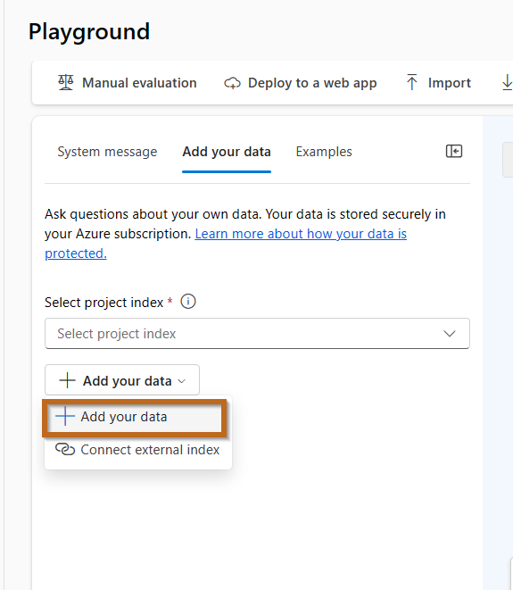
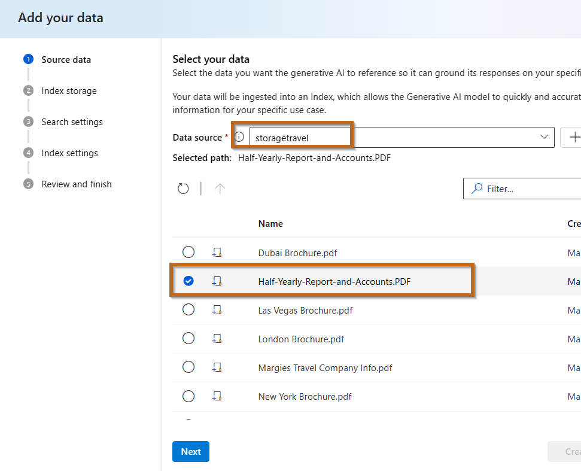
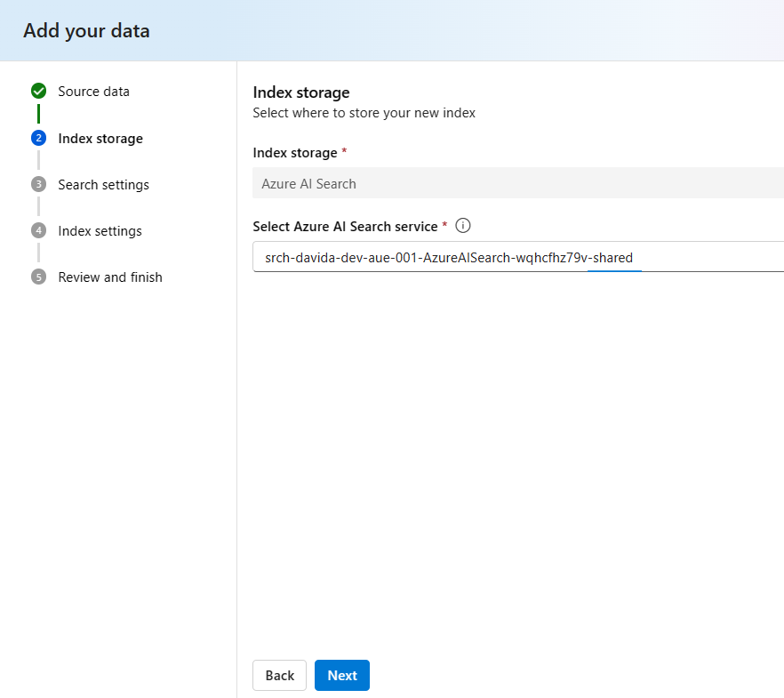
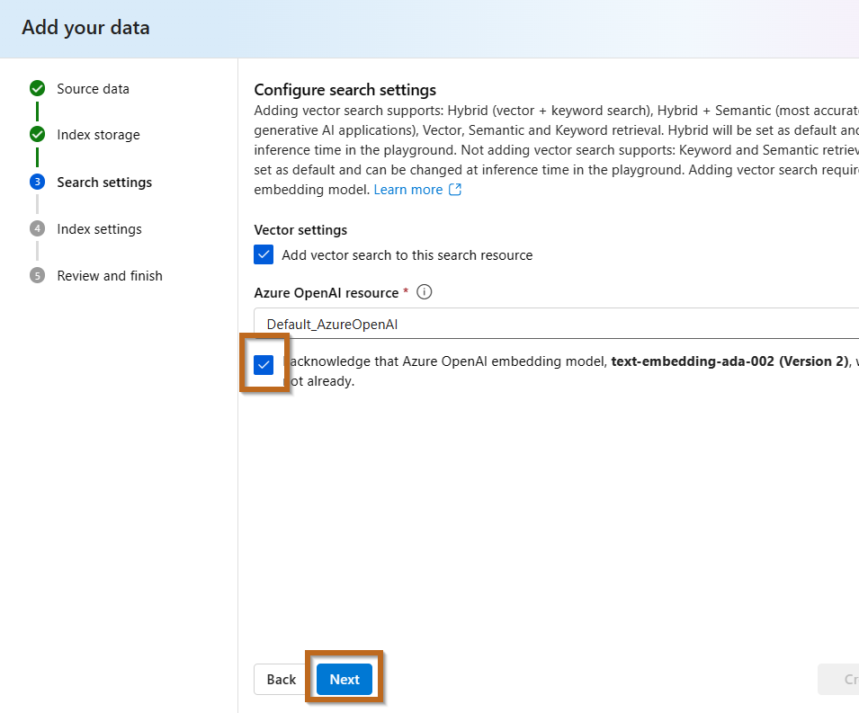
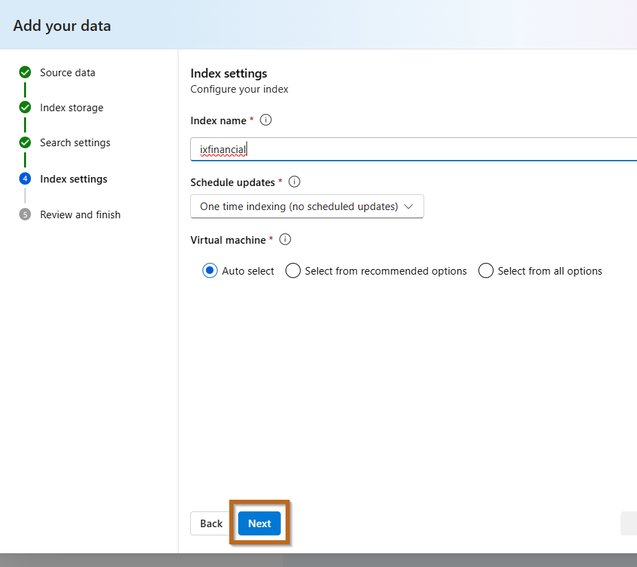
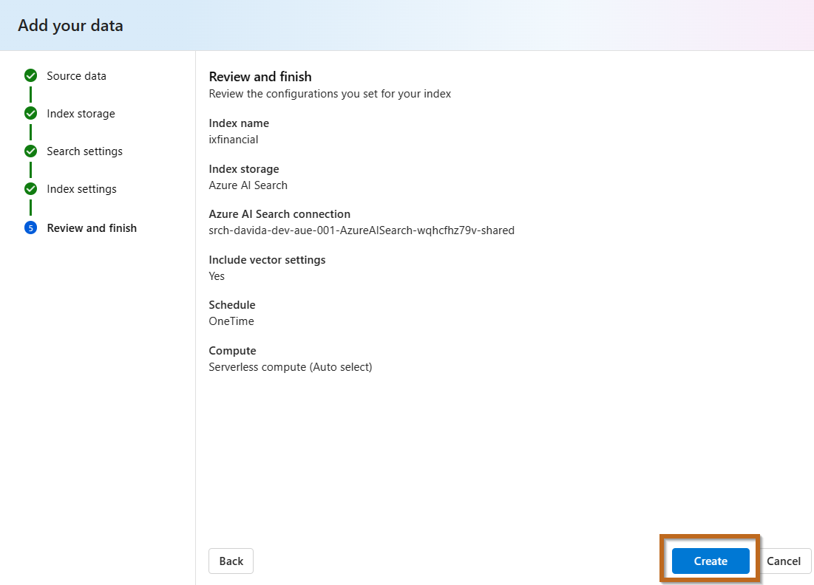
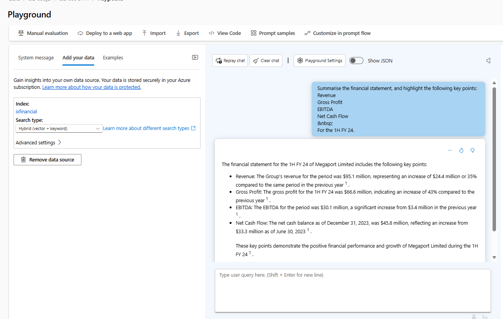
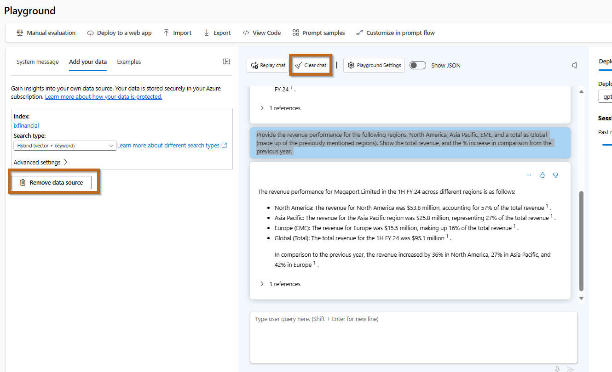
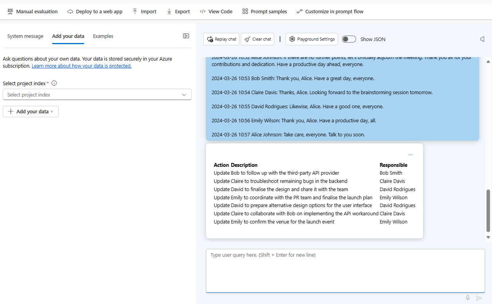

# Summarise Information
Some sample use cases for summarising information include:
- Summarising Meeting Minutes
- Summarising Meeting Agendas
- Summarising Financial Statements
- Summarising Information in a File


**Duration: 10 to 15 minutes**


## Introduction
As part of this exercise we are going to summarise a financial statement documents to validate some of the capablities of the models.


## Summarise Financial Statement

In this exercise, we will summarise the financial statement of a publicly listed company.

1. **Download the following documents:**

   - [Summary](../../media/summarise-information/1H-FY24-Investor-Presentation.PDF)
   - [Financial Statement](../../media/summarise-information/Half-Yearly-Report-and-Accounts.PDF)

2. **Add Your Data:**

    

3. **Select the Financial Document:**

    

4. **Configure the Index Storage:**

    

5. **Search Settings:**

    

6. **Index Settings:**

    

7. **Review and Finish:**

    


> **Note**: When you reach this stage, please inform the instructor.


This step will take a few minutes (10 to 30 minutes); feel free to take a short break.


```
Summarise the financial statement, and highlight the following key points:
Revenue
Gross Profit
EBITDA
Net Cash Flow
For the 1H FY 24.
```




Open the "1H-FY24-Investor-Presentation.PDF" documented downloaded before and navigate to page #3, is the information correct?


Trying with a more complext prompt.

```
Provide the revenue performance for the following regions: North America, Asia Pacific, EMEA, and a total as Global (composed of the previously mentioned regions). Show the total revenue and the percentage increase compared to the previous year.
```

Open the "1H-FY24-Investor-Presentation.PDF" documented downloaded before and navigate to page #4, is the information correct?


The model might not be accurate for multiple reasons, including:
- **Context Understanding**: ChatGPT may struggle to grasp full document context, leading to incomplete or inaccurate summaries.
- **Complex Information**: Summarising technical content accurately requires deep subject matter understanding, posing challenges for the model.
- **Dealing with Ambiguity**: Documents often contain ambiguous information, challenging for ChatGPT to summarise effectively.
- **Coherence Maintenance**: Ensuring summary coherence and logical flow while condensing information is a model challenge.
- **Identifying Key Points**: ChatGPT may have difficulty distinguishing essential information, leading to critical point omission.
- **Variability Handling**: Document variability in structure, style, and content makes one-size-fits-all summarisation challenging.
- **Length Constraint Addressing**: Summaries often have length limits, requiring effective information prioritisation and condensation.
- **Unstructured Data Handling**: Documents may contain unstructured data, such as tables or images, challenging for accurate summarisation.
- **Subjectivity Accounting**: Summarising subjective content accurately requires nuanced understanding, posing difficulties for the model.
- **Multimodal Content**: Documents may include text and multimedia elements, adding complexity to summarisation.

Remove the data source and clear chat.




## Sumarising Meeting Minutes
Summarising meeting minutes offers an efficient means to reduce administrative burden. By hosting structured discussions and highlighting key action items, we facilitate easier retrieval of specific information.

Use the following prompt:

```
Summarise the following meeting minutes, I want a table with the following columns as a result: Action, Description, Responsible.


2024-03-26 10:00 Alice Johnson: Good morning, everyone. Let's start with a review of our project milestones. Bob, could you provide an update on the development progress?
2024-03-26 10:01 Bob Smith: Sure, Alice. We've completed the frontend development and are now focusing on backend integration. We're slightly behind schedule due to unexpected issues with third-party APIs.
2024-03-26 10:03 Alice Johnson: Thanks, Bob. Claire, how's the backend integration going from your perspective?
2024-03-26 10:05 Claire Davis: We've managed to resolve most of the issues, but there are still a few bugs to iron out. I estimate we'll need another two days to finalise the integration.
2024-03-26 10:07 Alice Johnson: Okay, let's make sure to allocate resources accordingly to meet the deadline. David, how's the design aspect coming along?
2024-03-26 10:09 David Rodrigues: The design is on track. We've incorporated the feedback from the stakeholders and are finalising the UI elements. I anticipate completing the design by the end of the week.
2024-03-26 10:11 Alice Johnson: Great to hear. Emily, any updates from the marketing side?
2024-03-26 10:13 Emily Wilson: We've started drafting the marketing strategy and have scheduled a meeting with the PR team next week to discuss the launch plan.
2024-03-26 10:15 Alice Johnson: Perfect. Now, let's define the action items. Bob, can you follow up with the third-party API provider to address the integration issues?
2024-03-26 10:17 Bob Smith: Sure thing, Alice. I'll reach out to them today and provide an update by tomorrow.
2024-03-26 10:19 Alice Johnson: Claire, please continue troubleshooting the remaining bugs in the backend and keep me updated on the progress.
2024-03-26 10:21 Claire Davis: Will do, Alice. I'll prioritise resolving the bugs and will keep you informed.
2024-03-26 10:23 Alice Johnson: David, finalise the design by Friday and share it with the team for feedback.
2024-03-26 10:25 David Rodrigues: Understood, Alice. I'll ensure the design is ready for review by the end of the week.
2024-03-26 10:27 Alice Johnson: Emily, coordinate with the PR team and finalise the launch plan by next Wednesday.
2024-03-26 10:29 Emily Wilson: Absolutely, Alice. I'll work closely with the PR team and ensure we have a solid plan in place.
2024-03-26 10:31 Alice Johnson: Excellent. If there's no other business, let's adjourn the meeting. Thank you, everyone.
2024-03-26 10:32 David Rodrigues: Before we adjourn, Alice, I'd like to suggest exploring alternative design options for the user interface. It might enhance user experience.
2024-03-26 10:34 Alice Johnson: That's a good point, David. Let's schedule a brainstorming session for tomorrow to discuss the design alternatives.
2024-03-26 10:36 David Rodrigues: Sounds good, Alice. I'll prepare some mockups for the session.
2024-03-26 10:38 Alice Johnson: Perfect. Let's make sure to involve the entire team in the brainstorming session to gather diverse perspectives.
2024-03-26 10:40 Bob Smith: Also, Alice, I've found a workaround for one of the API issues. I'll share the details with Claire so she can incorporate it into the backend integration.
2024-03-26 10:42 Alice Johnson: That's great news, Bob. Claire, please collaborate with Bob on implementing the workaround into the backend.
2024-03-26 10:44 Claire Davis: Will do, Alice. I'll coordinate with Bob to integrate the workaround effectively.
2024-03-26 10:46 Alice Johnson: Fantastic teamwork, everyone. Let's continue this momentum and keep pushing forward. Any other points before we conclude?
2024-03-26 10:48 Emily Wilson: Just a quick reminder, Alice. We need to confirm the venue for the launch event. I'll take care of that today.
2024-03-26 10:50 Alice Johnson: Thank you, Emily. Please keep us updated on the venue confirmation.
2024-03-26 10:52 Alice Johnson: If there are no further points, let's officially adjourn the meeting. Thank you all for your contributions and dedication. Have a productive day ahead, everyone.
2024-03-26 10:53 Bob Smith: Thank you, Alice. Have a great day, everyone.
2024-03-26 10:54 Claire Davis: Thanks, Alice. Looking forward to the brainstorming session tomorrow.
2024-03-26 10:55 David Rodrigues: Likewise, Alice. Have a good one, everyone.
2024-03-26 10:56 Emily Wilson: Thank you, Alice. Have a productive day, all.
2024-03-26 10:57 Alice Johnson: Take care, everyone. Talk to you soon.
```

Review the output.




## Exercise Completion
You've successfully summarized financial statements and meeting minutes. This exercise enhanced your ability to condense complex information and extract key insights efficiently.
