# Business Case
Many organisations lack mature processes for business case development, with inconsistent approaches to funding data projects.

The trend of discretionary spending on data projects is declining. A shift towards stringent, outcome-focused justifications for IT and Data Project investments is emerging.

Technologies like ChatGPT are becoming essential in streamlining business case creation. They enhance efficiency, ensure project sustainability, and support the transition to a more mature justification process.

**Duration: 20 to 30 minutes**

## Introduction

In this activity, you will leverage OpenAI to draft a business case for one of the following systems, you can choose one:
- Creating a data warehouse
- Create a master data management system for customer information
- Implementing a business glossary
- Migrating the databases to the cloud
- Creating a data quality report


The information will be added into a word document and shared with the instructor at the end of the exercise.

As part of this exercise, use fictional information or information relevant to your organisation.

Each group or individual will present their Business Case to the rest of the participants. This will be followed by a feedback session to discuss the approaches and learn from each other.

# Download Template
Download the following template:

[Download Template](../../../Labfiles/create-business-case/Business_Case_Template.docx)

Populate the different sections as you progress with the exercise.

If you don't have Microsoft Word, you can use one of the available OneNote pages, rename it to your name. 


https://davidalzamendi-my.sharepoint.com/:o:/g/personal/david_techtalkcorner_com/EiKbiU2rOv5KjW1gPbZWiSoBUaL3gws_YB1xKAqnzg_ssQ?e=0s91yE


## Components of the Business Case

- Executive Summary: A concise overview that highlights the business case's main points, conclusions, and recommendations.
- Current State and Opportunities: Detailed analysis of the current situation, including challenges, and identification of opportunities for improvement or growth.

- Implementation Plan: Includes detailed timeline, milestones, resource allocation, and any dependencies or critical path items.

- Cost-Benefit Analysis: A thorough comparison of the anticipated costs against the benefits, including both quantitative and qualitative benefits.

- Recommendations: Clear and actionable recommendations based on the analysis and findings of the business case.

- Risk Analysis: Identifies potential risks and issues associated with the project, including likelihood, impact, and proposed mitigation strategies.

- Financial Projections: Detailed financial projections and the expected return on investment (ROI), including a break-even analysis.

- Stakeholder Analysis: Identification of stakeholders, their interests, impacts, and how they will be engaged or managed throughout the project.

- Market Analysis (if applicable): Analysis of market conditions, competitive landscape, and how the project aligns with market needs or opportunities.

- Project Governance: Outlines the governance structure, roles and responsibilities, decision-making processes, and communication plans.


## Instructions

## Add System Message.
Add the following system message.

```
You are now operating as a Business Case Analyst, specializing in data solutions within the framework of the DAMA DMBOK (Data Management Body of Knowledge). With extensive experience in formulating compelling business cases, you apply best practices from DAMA DMBOK to justify investments in data management initiatives, such as data warehouses, data lakes, and analytics platforms. Your expertise is in demonstrating how these solutions align with business objectives, enhance decision-making processes, and provide quantifiable advantages, all within the guidelines of the recognized data management standard.
```

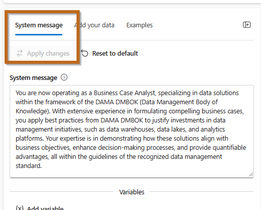

## Current State and Opportunities
Detailed analysis of the current situation, including challenges, and identification of opportunities for improvement or growth.

Use the following prompt, **change the placeholders** as required.

```
I am creating a business case for {Creating a data warehouse, Creating a master data management system for customer information, Implementing a business glossary, Migrating the databases to the cloud, Creating a data quality report} that will help {increase revenue, reduce costs or reduce risk}. We currently don't have this system; therefore, I need to create a section about the current state and opportunities for implementing this system. Summarise the information in two sections: current state and opportunities.
```

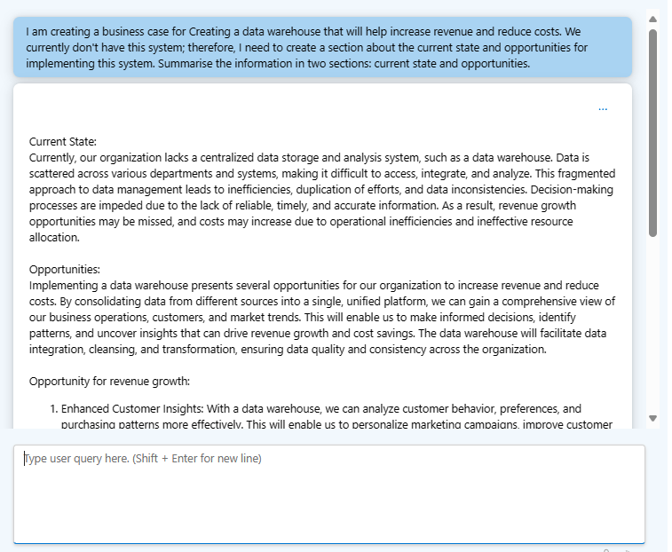

Populate the template as follow.

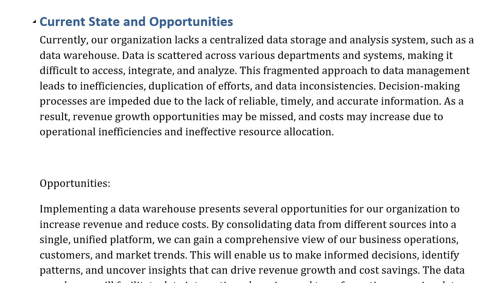


## Recommendations
Clear and actionable recommendations based on the analysis and findings of the business case.

Use the following prompt, change the placeholders as required.

```
Give me a list of recommendations that I can include in the business case that help align the new solution  with the overarching business goals and objectives.

```
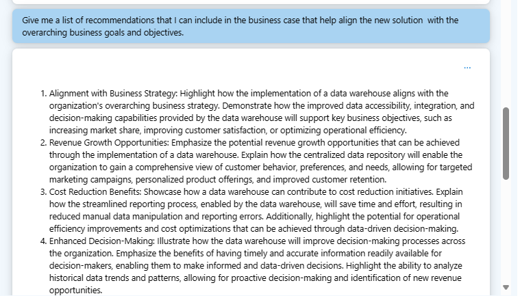

Populate the template as follow.

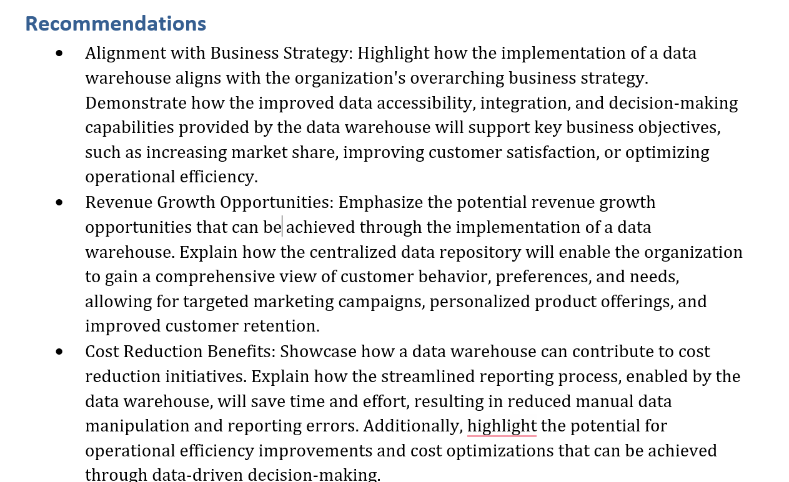


## Implementation Plan (Timeline, Milestones and Resource Allocations)
 Includes detailed timeline, milestones, resource allocation, and any dependencies or critical path items.


Use the following prompt, change the placeholders as required.

```
We plan to implement this system within the next 36 months, aimed at achieving {increase revenue, reduce costs or reduce risk}. With an allocated budget of ${dollar amount} for the upcoming three years during the implementation phase, we seek detailed recommendations on project timelines, key milestones, and the allocation of resources to support the activities involved in this implementation. 
Your suggestions should encompass a strategic roadmap, potential risks and mitigation strategies, and an outline of essential personnel and technology resources needed.

```
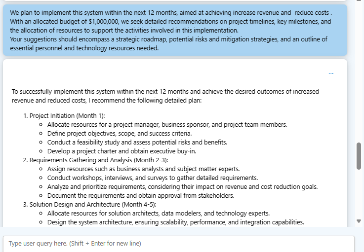

Populate the template as follow.

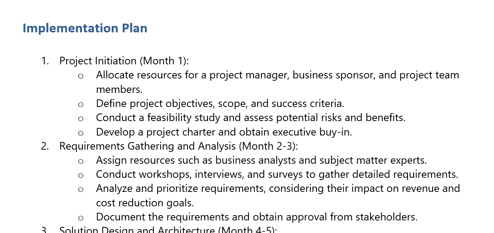


## Cost-Benefit Analysis
A thorough comparison of the anticipated costs against the benefits, including both quantitative and qualitative benefits.

Use the following prompt, change the placeholders as required.

```
Taking into account:
- Don't take into account year 0
- Years 1 (current year) to 3: Estimated cost of ${INCLUDE YOUR BUDGET} split into three years
- After year 3: 10% of the initial investment for ongoing BAU
- An ongoing benefit of ${INCLUDE DOLLAR BENEEFIT} evident after year 3
- Discount rate of 10%
Utilising the Net Present Value tool and considering a 7-year period, provide all the figures per year and summarise the information for inclusion in the business case document intended for leadership review. Calculate the Net Present Value for each year and highlight whether the amount after 7 years is positive or negative.
```

Repeat the steps and change the benfits until the Net Present Value is positive.
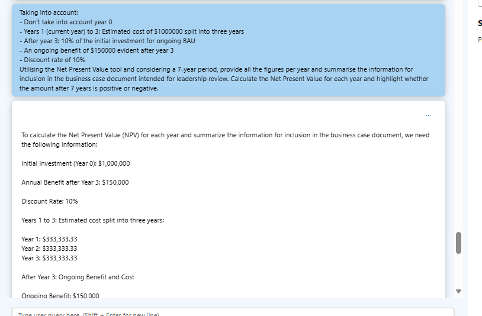

Populate the template as follow.

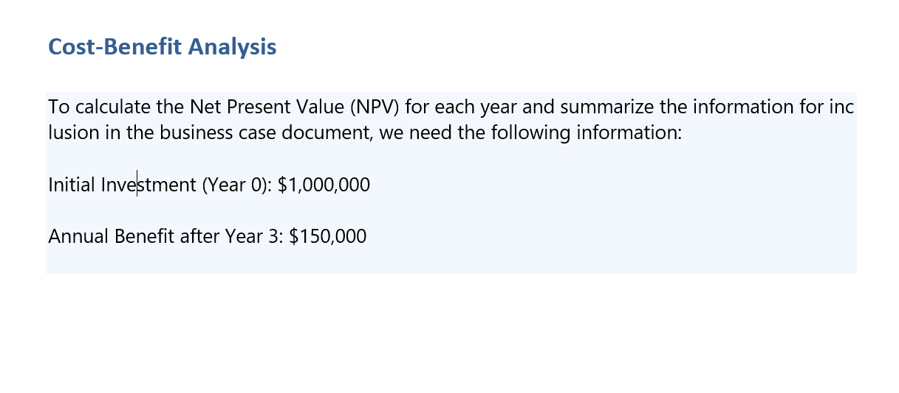


## Executive Summary
A concise overview that highlights the business case's main points, conclusions, and recommendations.

Use the following prompt, change the placeholders as required. You need to copy and paste all the information gathered before in your template.

```
Create an Execute Summary for the business case using the information mentioned below. All the information has to be provided in text so it can be included at the beginning of the document, use plain English.

{PASTE ALL THE TEMPLATE INFORMATION}
```
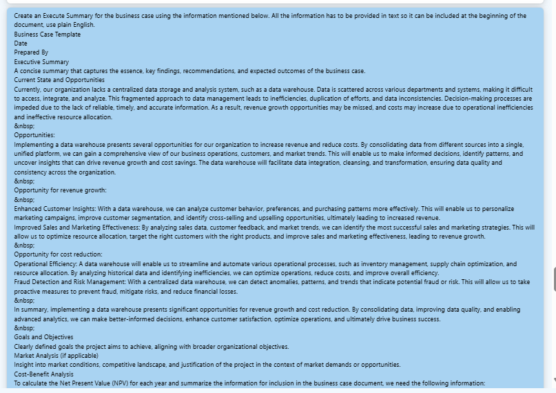


Populate the template as follow.

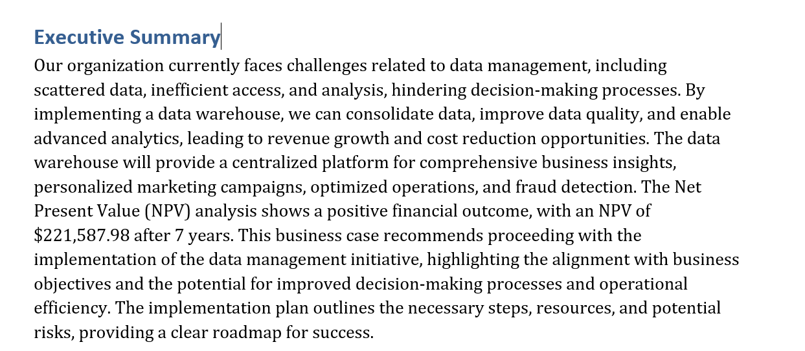


# Upload Solution
Rename the template with your first name and last name and upload it into:

https://actionabledataanalytics.sharepoint.com/:f:/s/DataCommunity/EsdTlaiOXd5MtJ3-4dKUpXUB3FJijzcCjlwTCQiL0PqF_Q?e=L6a6gA

If you are using OneNote, it is not required.

Review the following sample:
[Sample Business Case](../../../Labfiles/create-business-case/Business_Case_Template_Sample.docx)

# Summary
Congratulations! You have created a business case taking advantage of generative AI.