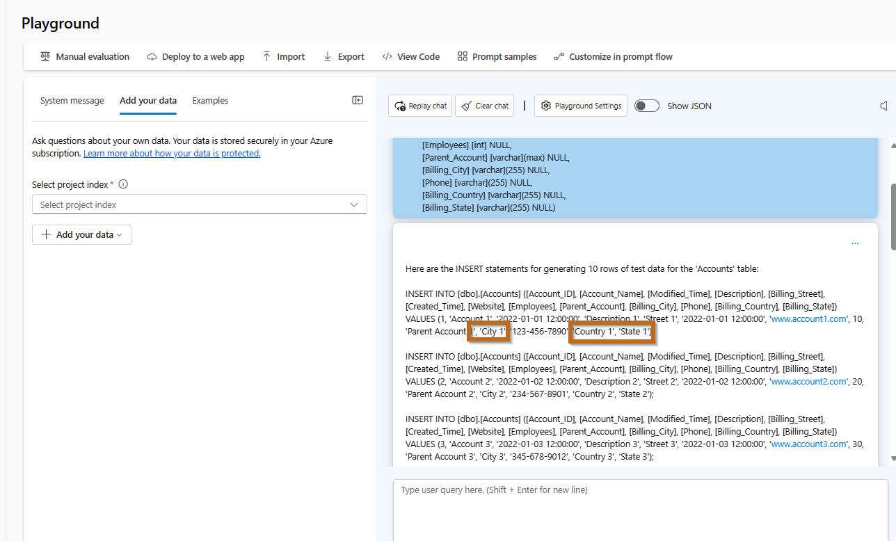
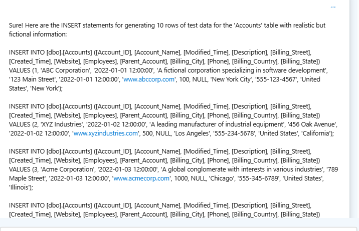
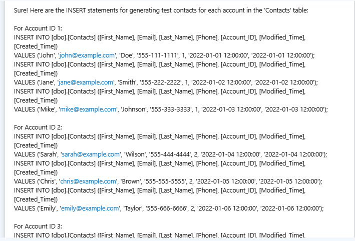

# Exercise: Generating Test Data for a Database with ChatGPT


**Objective:** Create realistic test data for the `Accounts` table schema.

**Key Steps:**
1. **Provide Detailed Schema:** Give ChatGPT the `Accounts` table schema.
2. **Craft Precise Prompts:** Include requirements for realistic and hierarchically consistent data.
3. **Generate and Review Data:** Use ChatGPT to generate data, then format it into SQL `INSERT` statements.

**Outcome:** Learn to use ChatGPT for efficient test data generation, enhancing database development workflows.


**Duration: 5 to 10 minutes**


## Background
In the realm of database development and testing, generating realistic test data is a critical yet often challenging task. Accurate and comprehensive test data ensures that database systems are robust, efficient, and capable of handling real-world scenarios. Manual data generation is not only time-consuming but also prone to errors, making it difficult to cover all possible test cases.

Automated test data generation, especially with the help of advanced tools like ChatGPT, offers a solution to these challenges. By leveraging AI, developers can quickly generate large volumes of realistic data that adhere to specific schema requirements. This not only speeds up the testing process but also improves the quality and reliability of database applications.


## Objective

Generate test data for the `Accounts` table based on the following schema, which can be copied from any RDBMS like Oracle, SQL Server, Informix, etc.:

```sql
CREATE TABLE [dbo].[Accounts](
	[Account_ID] [bigint] NOT NULL,
	[Account_Name] [varchar](255) NULL,
	[Modified_Time] [datetimeoffset](7) NULL,
	[Description] [varchar](max) NULL,
	[Billing_Street] [varchar](max) NULL,
	[Created_Time] [datetimeoffset](7) NULL,
	[Website] [varchar](max) NULL,
	[Employees] [int] NULL,
	[Parent_Account] [varchar](max) NULL,
	[Billing_City] [varchar](255) NULL,
	[Phone] [varchar](255) NULL,
	[Billing_Country] [varchar](255) NULL,
	[Billing_State] [varchar](255) NULL)
```


# Prompt
```
Based on the following SQL Server table schema for 'Accounts', please generate 10 rows of test data. Give me the Insert statements so I can insert the information into a table.

CREATE TABLE [dbo].[Accounts](
	[Account_ID] [bigint] NOT NULL,
	[Account_Name] [varchar](255) NULL,
	[Modified_Time] [datetimeoffset](7) NULL,
	[Description] [varchar](max) NULL,
	[Billing_Street] [varchar](max) NULL,
	[Created_Time] [datetimeoffset](7) NULL,
	[Website] [varchar](max) NULL,
	[Employees] [int] NULL,
	[Parent_Account] [varchar](max) NULL,
	[Billing_City] [varchar](255) NULL,
	[Phone] [varchar](255) NULL,
	[Billing_Country] [varchar](255) NULL,
	[Billing_State] [varchar](255) NULL)

```
Review the information provided by the model, are the results correct?


In most cases, providing a poor prompt will set you up to receive  poor results.



Modify the prompt to include better directions.


```
Based on the following SQL Server table schema for 'Accounts', please generate 10 rows of test data, the information needs to look real (with correct names, addresses, cities, etc) but don't use real information. 

Make sure the hierarchy between city, state and country exists and it is real.

Give me the Insert statements so I can insert the information into a table.

CREATE TABLE [dbo].[Accounts](
	[Account_ID] [bigint] NOT NULL,
	[Account_Name] [varchar](255) NULL,
	[Modified_Time] [datetimeoffset](7) NULL,
	[Description] [varchar](max) NULL,
	[Billing_Street] [varchar](max) NULL,
	[Created_Time] [datetimeoffset](7) NULL,
	[Website] [varchar](max) NULL,
	[Employees] [int] NULL,
	[Parent_Account] [varchar](max) NULL,
	[Billing_City] [varchar](255) NULL,
	[Phone] [varchar](255) NULL,
	[Billing_Country] [varchar](255) NULL,
	[Billing_State] [varchar](255) NULL)

```

Review the results, is the test data more accurate?





## Relationships
In many cases, you will want to generate test data that is related to the information in a different table. For those scenarios, you can use the "historical" information in the chat to continue asking for more information.

Example generating contacts:
```
generate 3, 5 or 10 test contacts per each account. Taking into account the following Contacts schema. The information needs to look real. Generate the insert statements.

CREATE TABLE [dbo].[Contacts](
	[First_Name] [varchar](255) NULL,
	[Email] [varchar](255) NULL,
	[Last_Name] [varchar](255) NULL,
	[Phone] [varchar](255) NULL,
	[Account_ID] [bigint] NULL,
	[Modified_Time] [datetimeoffset](7) NULL,
	[Created_Time] [datetimeoffset](7) NULL,
)

```



## Exercise Completion
In this exercise, you learned to use ChatGPT for generating realistic test data for a database schema. By providing a detailed schema and crafting precise prompts, you discovered how to create accurate and hierarchically consistent SQL `INSERT` statements. This skill is essential for enhancing your database development and testing workflows.


