# Data Governance Charter

## Introduction


In this activity, you will use OpenAI to draft a comprehensive Data Governance Charter for neither a hypothetical or real organisation. This charter will act as a foundational document, outlining the strategy for managing and safeguarding data across the enterprise.

The information will be compiled into a Word document and shared with the instructor at the end of the exercise.

Please use either fictional details or information pertinent to your organisation for this exercise.

Each group or individual will present their Data Governance Charter to the other participants. This presentation will be followed by a feedback session to discuss the various approaches and learn from one another.

**Duration: 45 to 60 minutes**

# Download Template
For this exercise, download the following template where information will be captured.

[Download Template](../../../Labfiles/create-data-governance-charter/Data_Governance_Charter_Template.docx)

If you don't have Microsoft Word, you can use one of the available OneNote pages, rename it to your name. 


https://davidalzamendi-my.sharepoint.com/:o:/g/personal/david_techtalkcorner_com/EiKbiU2rOv5KjW1gPbZWiSoBUaL3gws_YB1xKAqnzg_ssQ?e=9PCToS


# Data Governance Charter Components


- **Benefits and ROI / Purpose** (we will focus on benefits as part of this exercise): The charter should identify the expected benefits and return on investment (ROI) of the Data Governance program, both in terms of tangible outcomes (e.g., cost savings, efficiency improvements) and intangible benefits (e.g., increased trust in data, better decision-making).


- **Mission:** Define the primary purpose of data governance within your organisation, emphasising its importance in achieving business objectives.

- **Vision:** Describe the future state or ultimate goal that your organisation seeks to achieve through its data governance efforts.

- **Operating Model:** Outline how data governance will be structured and implemented across the organisation. Include details on roles, responsibilities, and governance structures.

- **Guiding Principles:** List the key principles that will guide your organisation’s data governance activities, ensuring alignment with overall business strategies and ethical considerations.

- **Standards and Policies:** Specify the core standards and policies that will govern data management practices, including data quality, privacy, and security measures.

- **Program of Work:** Draft an initial three-month program of work, highlighting the key initiatives and projects that will kickstart your data governance efforts.


This section should clearly state the purpose of the data governance programme. It should explain what the organisation hopes to achieve through data governance.


## Instructions

## Add System Message.
Add the following system message.

```
You are now functioning as a Data Governance Consultant, proficient in the DMBOK framework and Data Governance best practices. You have extensive experience in designing and implementing data governance programs across a variety of industries. Your expertise includes a profound understanding of developing Data Governance Charters
```
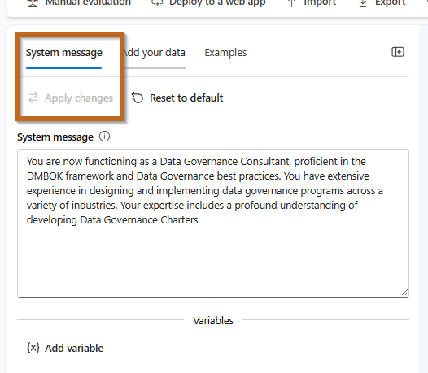

## Create Benefits /  Purpose Section
 The charter should identify the expected benefits and return on investment (ROI) of the Data Governance program, both in terms of tangible outcomes (e.g., cost savings, efficiency improvements) and intangible benefits (e.g., increased trust in data, better decision-making).


Use the following prompt, change the placeholders as required.

```
Create an introductory section for a data governance charter. This should highlight the benefits in relation to supporting the business goals of {increasing revenue, reducing risk, reducing cost} in a company in the industry {Include your company industry}. Keep it to three sentences.
```

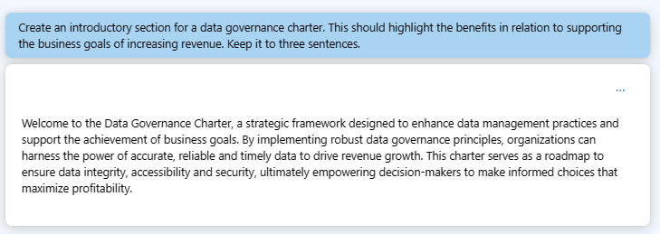


Populate the template.

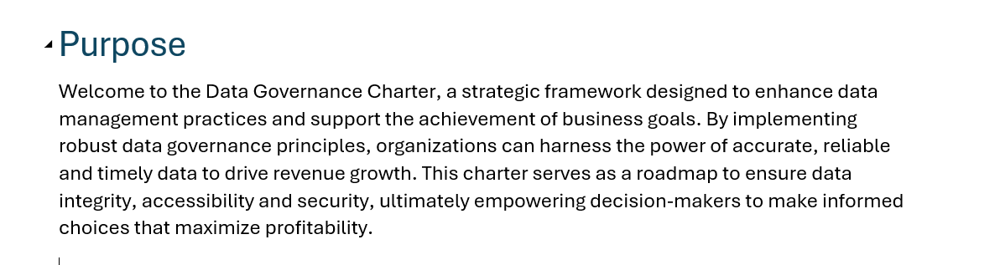

## Create Mission Statement
A mission statement outlines the organisation's current purpose or initiative. 
It specifies what is done, for whom it is done, and how it is accomplished.

**Example:**
To establish and enforce policies and procedures that ensure the integrity, security, and availability of our organisation's data, supporting informed decision-making and compliance with legal and regulatory requirements, for the benefit of our employees, customers, and partners.

In the model, include the following prompts, modifying the placeholders:


```
Create a mission statement for an organisation that focuses on {Your Company Industry} and its purpose is {Company Purpose}, with a specific emphasis on Data Governance. Ensure it reflects our core value of {CHOOSE ONE COMPANY VALUE, FOR EXAMPLE: INTEGRITY, COLLABORATION}. Keep it concise, inclusive, and easy to understand, articulating the WHAT, WHOM, and HOW in no more than two sentences.

```
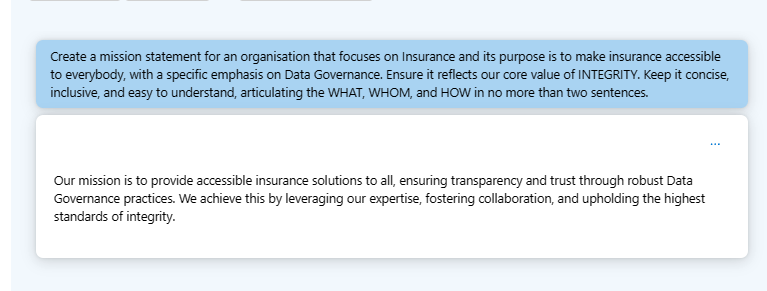

Add the information into the template.

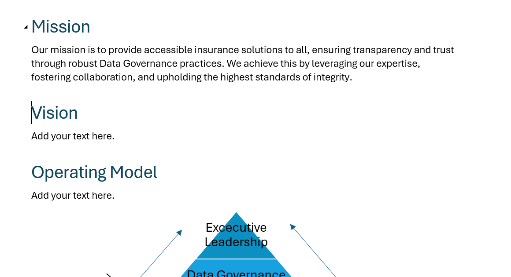


## Create Vision Statement
A vision statement is a forward-looking declaration that outlines what the organisation or initiative aims to achieve in the future. It serves as a guide for choosing current and future courses of action. The key components are the goal (what), the method (how), and the beneficiaries (whom).


**Example:**
To be recognised as a leader in data governance, where our data assets drive innovation, operational excellence, and strategic decisions, enhancing our competitive advantage and customer satisfaction.


In the model, include the following prompt:

```
Create a motivational vision statement for an organisation that focuses on {Your Company Industry}, with a specific emphasis on Data Governance. Ensure it reflects our core value of {CHOOSE ONE COMPANY VALUE, FOR EXAMPLE: INTEGRITY, COLLABORATION}. Keep it concise, inclusive, and easy to understand, articulating the WHAT, WHOM, and HOW in no more than three sentences.

```
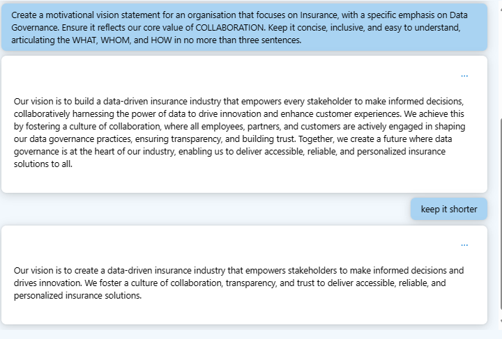


Add the information into the template.


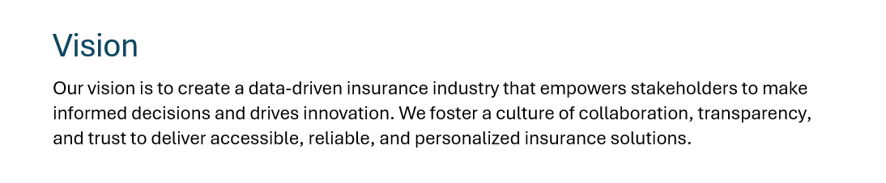


## Creating an Operating Model
An operating model identifies how we are going to operate:
- Key Stakeholders
- Communication Pathways
- Risk Management
- Decision Making

There are multiple types of operating models:
- Centralised
- Decentralised
- Federated
- Hybrid
- Non-invasive

And more.

As part of this task, you will define the roles and responsibilities of the following hybrid model.


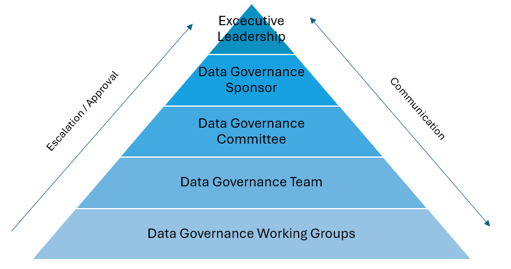

This operating model is a hybrid, combining centralised and decentralised elements. At the top, Executive Leadership sets the strategic direction and handles major escalations. Below them, a Data Governance Sponsor bridges the gap to the Data Governance Committee, which aligns governance actions with organisational strategy. Operational duties fall to the Data Governance Team, supported by Working Groups tackling specific governance tasks. Communication and decision-making flow through these layers, ensuring a cohesive governance structure.


You will capture one role at the time, go ahead and apply changes to make it relevant to your industry if required.

Executive Leadership prompt:
```
As part of preparing an operating model (Executive Leadership, Data Governance Sponsor, Data Governance Committee, Data Governance Team, and Data Governance Working Groups) for a Data Governance Program, define the responsibilities and accountabilities of Executive Leadership. Focus on their roles in providing funding and clarity on business priorities, nominating an executive sponsor, and appointing a committee member for each business area. Give me the response in two sections. Example:
Responsibilities
Sample responsiblities...


Accountabilities
Sample accountabilities...

Keep each bullet point to one sentence.
```

The result should be similar to the following message.


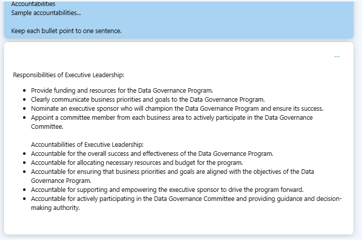


Populate the template.

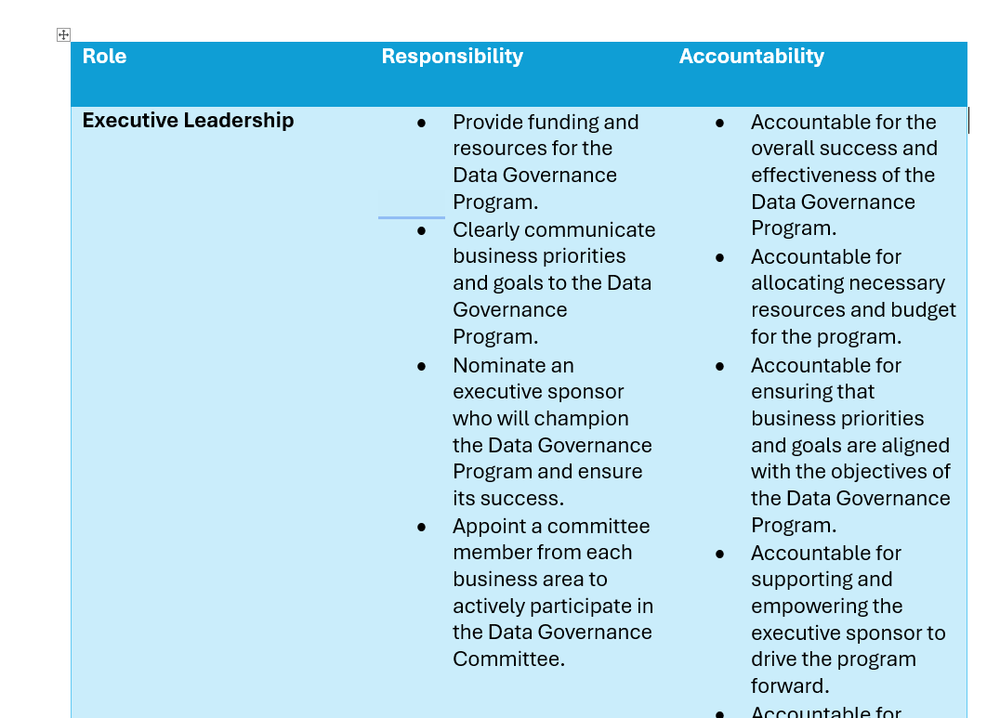

Repeat the same steps for the following roles.


Data Governance Sponsor prompt:
```
As part of preparing an operating model (Executive Leadership, Data Governance Sponsor, Data Governance Committee, Data Governance Team, and Data Governance Working Groups) for a Data Governance Program, define the responsibilities and accountabilities of the Data Governance Sponsor with emphasis on them securing funding, communicating achievements and challenges to Executive Leadership. Give me the response in two sections. Example:
Responsibilities
Sample responsiblities...


Accountabilities
Sample accountabilities...

Keep each bullet point to one sentence.
```

Data Governance Committee prompt:
```
As part of preparing an operating model (Executive Leadership, Data Governance Sponsor, Data Governance Committee, Data Governance Team, and Data Governance Working Groups) for a Data Governance Program, define the responsibilities and accountabilities define the responsibilities and accountability of the Data Governance Committee with emphasis on them allocating resources for performing data governance projects and nominating a proxy for the business area. Give me the response in two sections. Example:
Responsibilities
Sample responsiblities...


Accountabilities
Sample accountabilities...

Keep each bullet point to one sentence.
```


Data Governance Team prompt:
```
As part of preparing an operating model (Executive Leadership, Data Governance Sponsor, Data Governance Committee, Data Governance Team, and Data Governance Working Groups) for a Data Governance Program, define the responsibilities and accountabilities define the responsibilities and accountability of the Data Governance Team with emphasis on leading the data governance program by using best practices and defining the required data governance projects for achieving specific business outcomes, and leading the data literacy program. Give me the response in two sections. Example:
Responsibilities
Sample responsiblities...


Accountabilities
Sample accountabilities...

Keep each bullet point to one sentence.
```


Data Governance Working Groups prompt:
```
As part of preparing an operating model (Executive Leadership, Data Governance Sponsor, Data Governance Committee, Data Governance Team, and Data Governance Working Groups) for a Data Governance Program, define the responsibilities and accountabilities define the responsibilities and accountability of the Data Governance Working Groups with emphasis on them executing the required activities for finalising the project activities in a timely manner. Give me the response in two sections. Example:
Responsibilities
Sample responsiblities...


Accountabilities
Sample accountabilities...

Keep each bullet point to one sentence.
```


By the end of this section, you should have completed the table of roles and responsiblities.

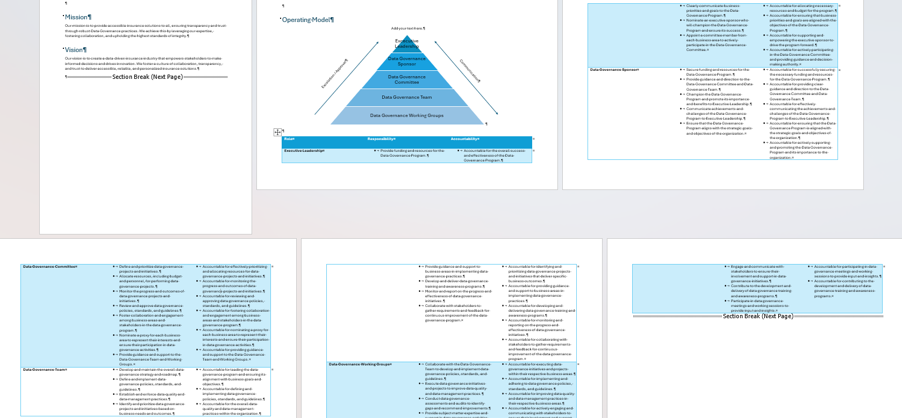


## Create Guiding Principles
Guiding principles are basic rules and preferred ways of handling data. They're not strict rules but are used to shape decisions and actions related to data management, aiming to improve how data is used and protected in an organization.

**Examples:**
- Data Quality: All data should be accurate, complete, and reliable. This principle guides the organisation in maintaining high standards for data entry, storage, and maintenance processes, ensuring that decisions are based on trustworthy information.
- Data Privacy: Protecting the privacy of individuals' data is paramount. This principle emphasizes the importance of complying with data protection regulations, securing personal information, and respecting user consent, shaping how data is collected, shared, and used.


In the model, include the following prompt:
```
Create two guiding principles related to (choose an item from the DAMA Wheel) that will form part of a Data Governance Charter. Each principle must include the following components: Name, Statement, Rationale, and Implications, following the TOGAF architecture principle components. Keep it simple, limiting to two sentences per item. Present the output in a table where the first column is the name of the principle, followed by columns for Name, Statement, Rationale, and finally Implications.

```

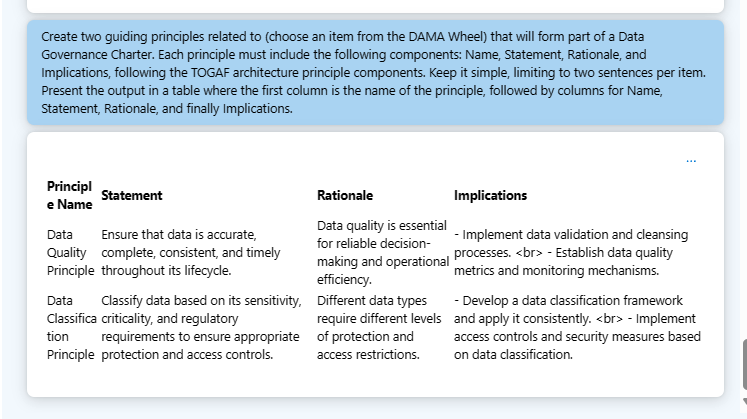

Complete the template.

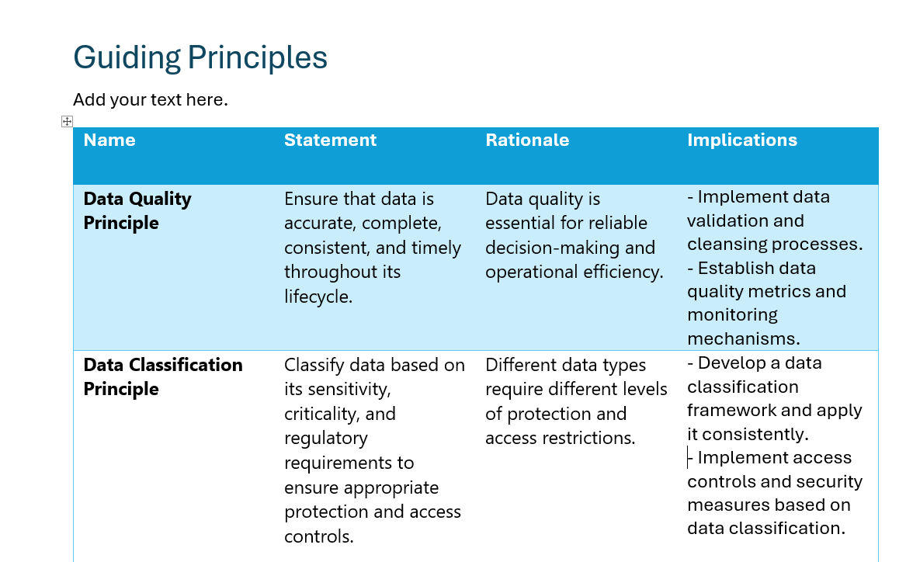

## Select Initial Standards

Standards are defined sets of criteria or technical specifications designed to ensure data is safe, reliable, and consistently perform as intended. Standards provide detailed instructions for definition, consumption and creation of data facilitating uniformity and compatibility in operations and production.
Examples: Exchange of Data, Data Encryption or Data Quality Standards.

Standards are usually stored in standalone documents rather than in the Data Governance Charter, but to simplify the activity, they will be included as part of the same document.


Populate with the information from the following prompt.

```
Define specific data type standards for storing customer demographic information across various systems, using reference standards like ANSI X12. The fields to consider include: First Name, Last Name, Phone Number, Post Code, Country, and Email. The results should be presented as a list with the following columns: Entity Name (in this case, Customer), Field, Data Type, Maximum number of Characters, Reference Standard (e.g., ANSI X12), and suggested Regex Rule.

```

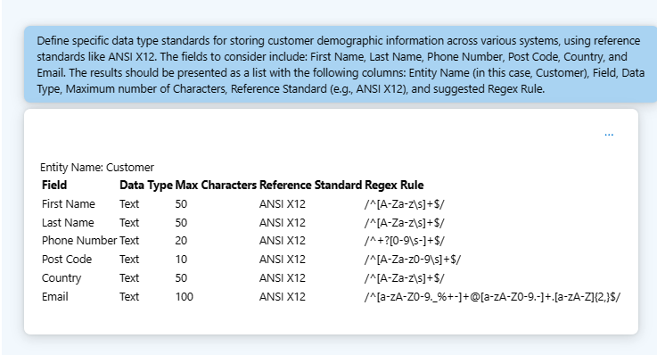

Populate the template.


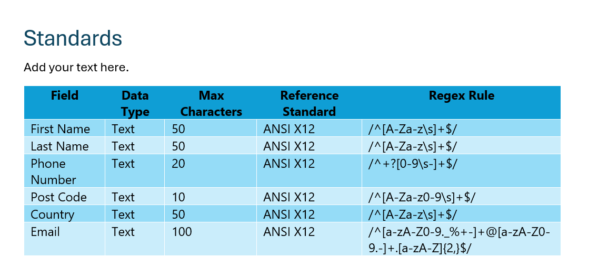


## Create Initial Policies
Policies are formal statements produced by an organisation that outline specific requirements or rules that must be followed. Policies set the framework for decision-making and allocate responsibilities and procedures to achieve the organisation's goals and objectives. They guide behaviour and operations, ensuring compliance with laws, regulations, and internal directives.
Examples: Data Access and Retention Policies.

Key Components Include:
- Purpose: Why the policy exists and what it aims to achieve.
- Scope: Who and what the policy applies to.
- Policy Statement: A clear and concise statement outlining the policy's rules, expectations, or procedures.
- Roles and Responsibilities: Who is responsible for implementing, monitoring, and ensuring compliance with the policy.
- Compliance and Enforcement: How compliance will be monitored and what the consequences of non-compliance are.
- Review and Update: When and how the policy will be reviewed and updated to remain relevant and effective.


Policies are usually standalone documents, separate from the Data Governance Charter.

For this exercise, we will incorporate them into the same document.


In the model, include the prompt below (modify the placeholder to choose one policy). Feel free to adjust the prompt to better align with your organization's specific needs:
```
Develop a {choose one: data access, data archival, classification, quality, retention and destruction, privacy, security, usage and sharing,} policy tailored to our data governance program, emphasizing the principle of 'least privilege' access. This policy should comprehensively cover the following key sections: Purpose, explaining the goals of the policy; Scope, delineating its applicability; Policy Statement, outlining the access principles; Roles and Responsibilities, defining duties related to data access; and Compliance and Enforcement, detailing adherence measures and consequences of policy violations.

```

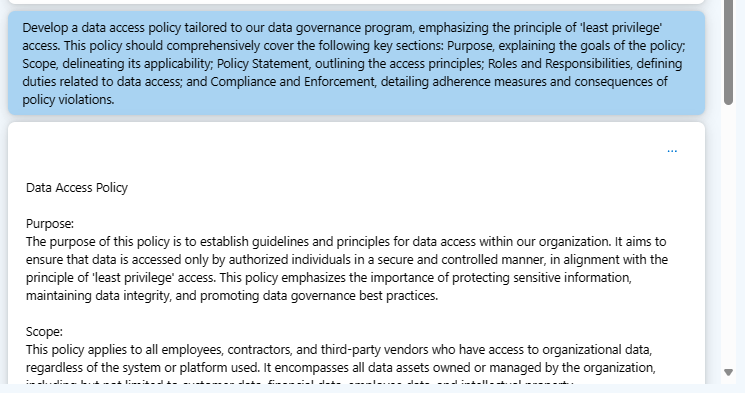


Populate the template.

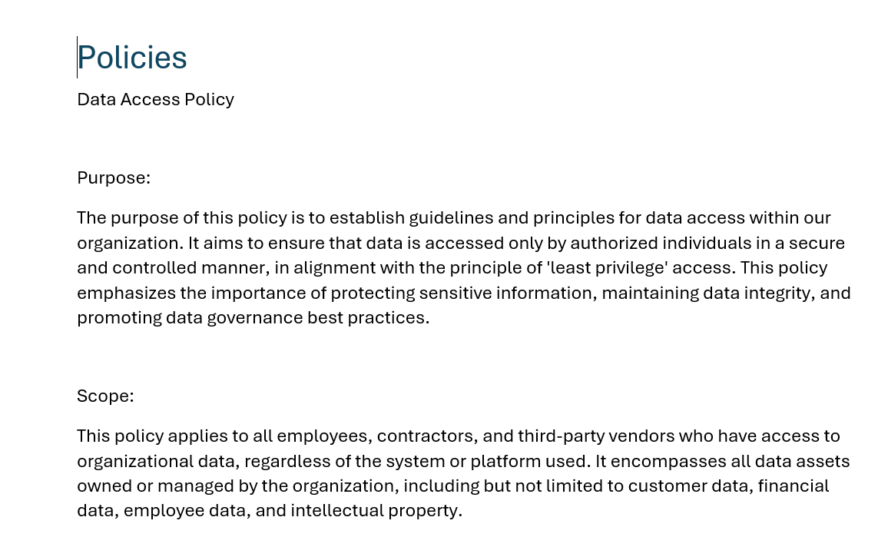


## Create Initial Program of Work

A Program of Work should contain:
What
Who
When

A Gantt chart is always helpful.


By using the following template

```
In our organisation, we are starting our Data Governance Program. Suggest a list of Data Governance projects that can be executed as part of this initial year (2024). Consider projects that can help set up the foundations of the Data Governance Program for upcoming years. The results need to be listed in a table with the following columns: Project Name, Departments Involved, Duration in Days, Start Date.
```
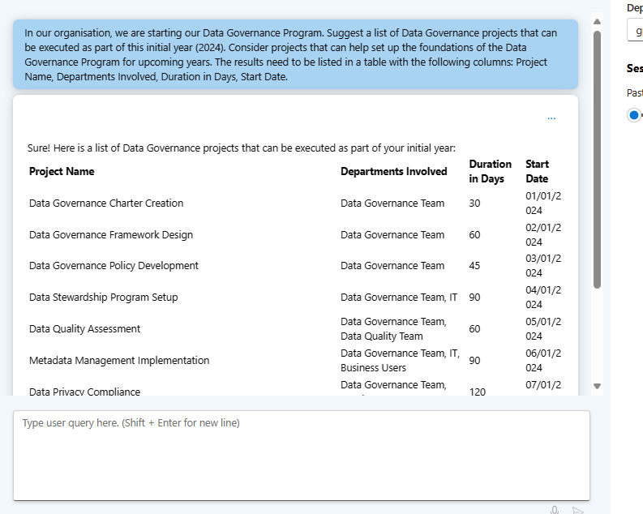


Populate the template.

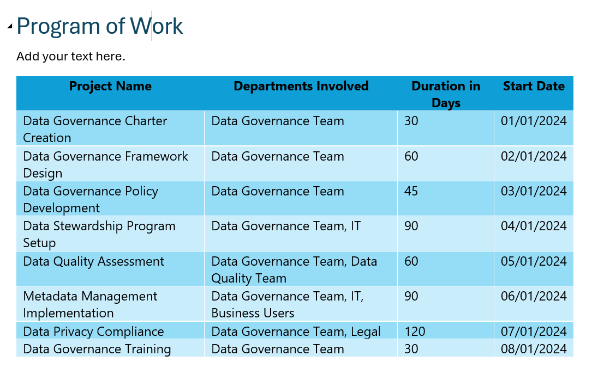


# Upload the Document
Rename the file with your first name and last name and upload the document to the following location.


https://actionabledataanalytics.sharepoint.com/:f:/s/DataCommunity/Esec9NEHHYJJv2r-JNmCp6EBwcY7I6yh_nr7UwY8dVlH8g?e=3t07us


Review the following sample:

[Sample Charter](../../../Labfiles/create-data-governance-charter/Data_Governance_Charter_Sample.docx)

# Expected Outcome

By the end of this activity, you will have created a draft Data Governance Charter that outlines a clear and actionable plan for managing your organization’s data effectively. This charter will serve as a critical tool in ensuring that data across your organization is governed in a manner that supports business objectives, compliance requirements, and strategic decision-making.

