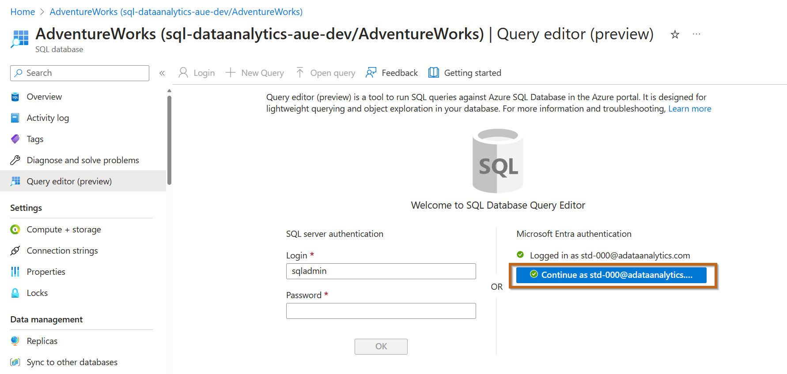
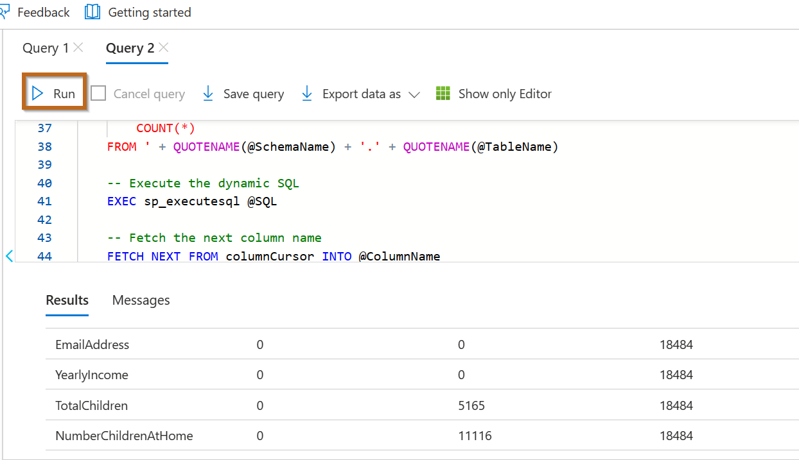

# Data Quality

## Introduction
Develop SQL Server scripts for data profiling to assess data completeness.


**Duration: 10 to 15 minutes**


## Data Profiling


```
Provide a SQL Server Scripts that scans all the columns with a loop in the table DimCustomer in the schema dbo. For each column. this query needs to capture the number of null values, empty values and number of rows. Make sure you include the schema name as part of querying the tables. 
```


Execute the query in the following server:
https://portal.azure.com/#@davidalzamendi.com/resource/subscriptions/b28149e7-f6d0-4008-adda-168958c87bc4/resourceGroups/rg-dataanalytics-dev-001/providers/Microsoft.Sql/servers/sql-dataanalytics-aue-dev/databases/AdventureWorks/queryEditor

Connect to the database.





Paste the query and execute it:



Does the query works? If it does not work, clear the chat and try again. 


ChatGPT could provide incorrect T-SQL code due to ambiguity in the prompt, lack of context, limitations in its training data, or misunderstanding language nuances. Reviewing and refining the generated code with expertise in SQL programming can help mitigate inaccuracies.


If after two or three attempts it does not work, try the following query generated by chat-gpt3.


```sql

-- Declare variables  
DECLARE @SchemaName NVARCHAR(128) = 'dbo'  
DECLARE @TableName NVARCHAR(128) = 'DimCustomer'  
DECLARE @ColumnName NVARCHAR(128)  
DECLARE @SQL NVARCHAR(MAX)  
  
-- Create a temporary table to store the results  
CREATE TABLE #ColumnStats (  
    ColumnName NVARCHAR(128),  
    NumNullValues INT,  
    NumEmptyValues INT,  
    NumRows INT  
)  
  
-- Declare a cursor to iterate through the columns  
DECLARE columnCursor CURSOR FOR  
SELECT COLUMN_NAME  
FROM INFORMATION_SCHEMA.COLUMNS  
WHERE TABLE_SCHEMA = @SchemaName  
    AND TABLE_NAME = @TableName  
  
-- Open the cursor  
OPEN columnCursor  
  
-- Fetch the first column name  
FETCH NEXT FROM columnCursor INTO @ColumnName  
  
-- Loop through each column  
WHILE @@FETCH_STATUS = 0  
BEGIN  
    -- Generate the dynamic SQL to get column stats  
    SET @SQL = N'  
    INSERT INTO #ColumnStats (ColumnName, NumNullValues, NumEmptyValues, NumRows)  
    SELECT ''' + @ColumnName + ''',  
        SUM(CASE WHEN ' + QUOTENAME(@ColumnName) + ' IS NULL THEN 1 ELSE 0 END),  
        SUM(CASE WHEN ' + QUOTENAME(@ColumnName) + ' = '''' THEN 1 ELSE 0 END),  
        COUNT(*)  
    FROM ' + QUOTENAME(@SchemaName) + '.' + QUOTENAME(@TableName)  
  
    -- Execute the dynamic SQL  
    EXEC sp_executesql @SQL  
  
    -- Fetch the next column name  
    FETCH NEXT FROM columnCursor INTO @ColumnName  
END  
  
-- Close and deallocate the cursor  
CLOSE columnCursor  
DEALLOCATE columnCursor  
  
-- Select the results  
SELECT * FROM #ColumnStats  
  
-- Drop the temporary table  
DROP TABLE #ColumnStats  
```


# Real Life Scenarios
In real life, this script will run on a daily or weekly basis and capture the information into a group of tables. Then, the information will be made available in a reporting tool like Power BI and accessible to as many subject matter experts (SMEs) as possible. This includes, but is not limited to, IT, business users, and leadership, ensuring they are aware of the current state of the data. This process helps secure funding and raises awareness.

# Prompting Table and Stored Procedure Structures
While you will not create the tables, the model is able to read the results beforehand, so it could ask for the structure of tables where the information needs to be stored.

```
By taking into account the query before, give me the table structure where the information needs to be stored and a stored procedure that will run the query above.
```


