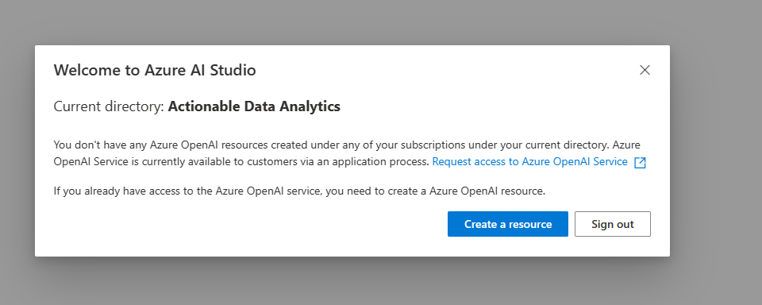
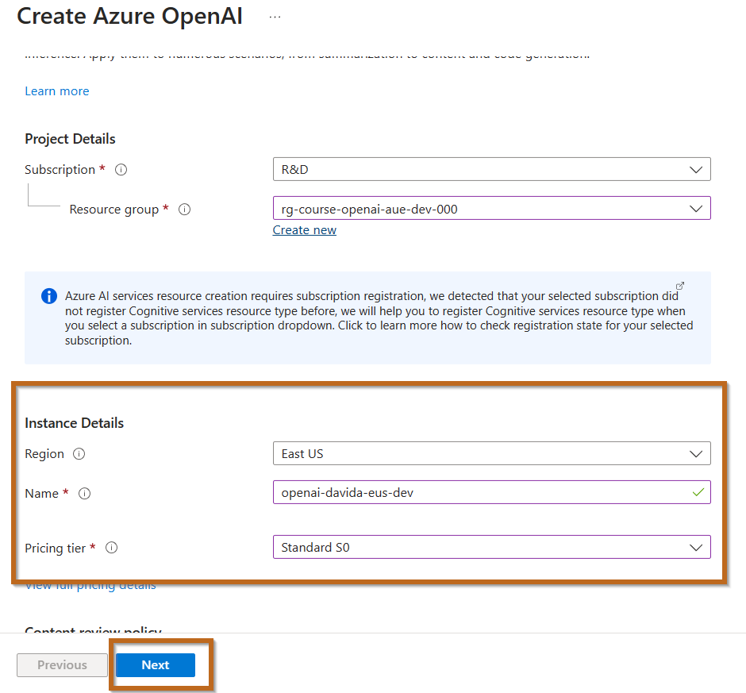
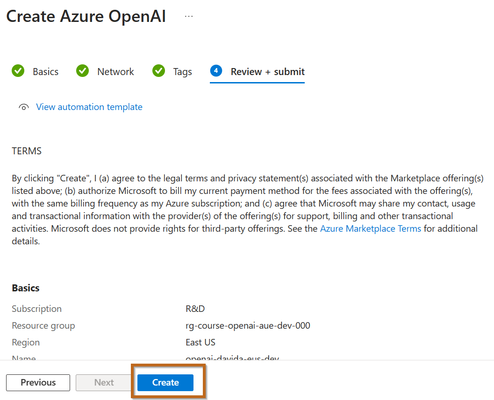
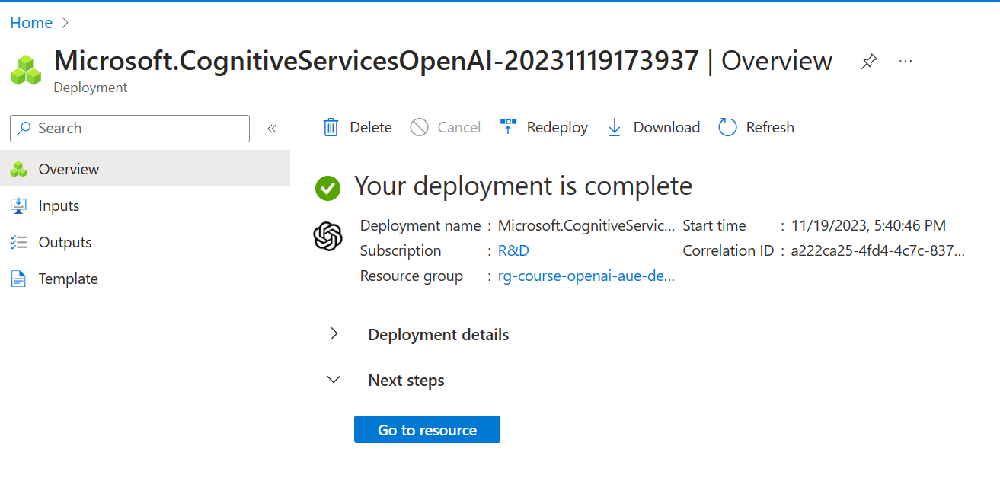
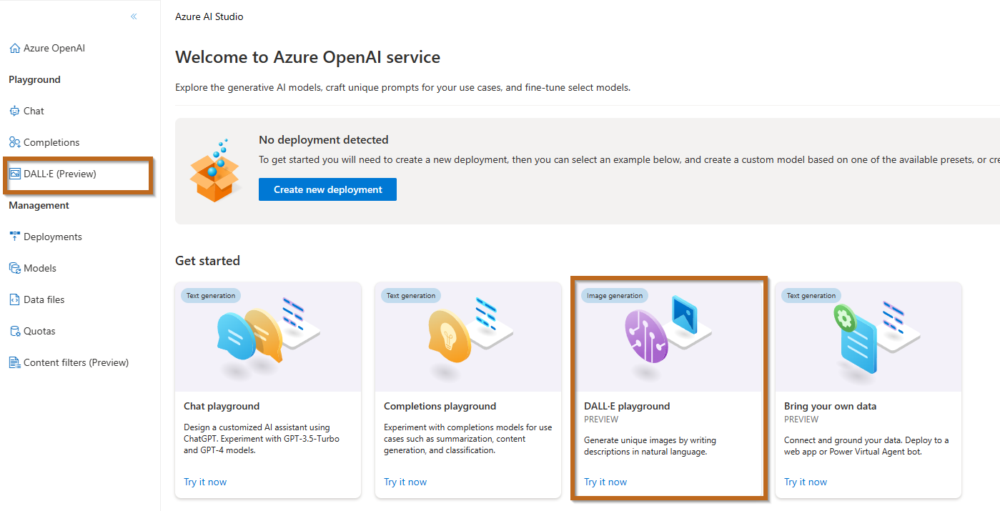
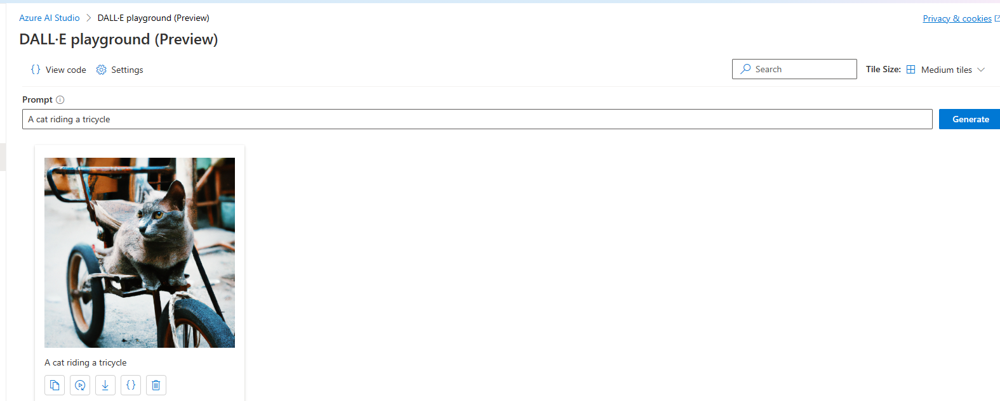
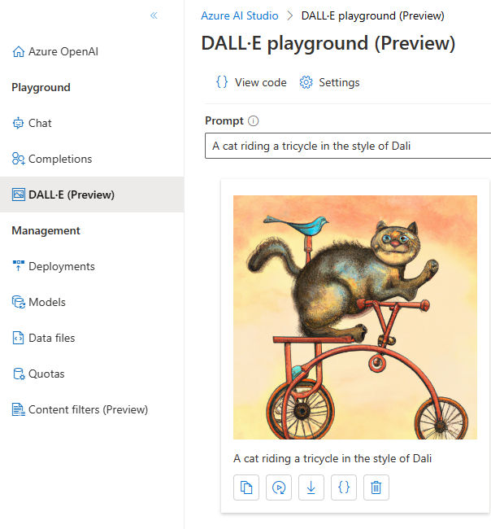

# Generate Images with a DALL-E Model

In this exercise, we will use Azure OpenAI Studio, as the DALL-E model is not available in Australia.

Duration: **15 to 20 minutes**

## Create Azure OpenAI

Navigate directly to [Azure OpenAI Studio](https://oai.azure.com/?azure-portal=true).

Configure the following options:

**Make sure you select EAST US**

Review and create:

Once the service is created, you can proceed to the next step:

## Explore Image-Generation in the DALL-E Playground

The DALL-E playground in **Azure OpenAI Studio** allows you to experiment with image-generation.

1. Navigate directly to [Azure OpenAI Studio](https://oai.azure.com/?azure-portal=true).
2. Select the **DALL-E Playground**.

   

3. In the **Prompt** box, enter an image description you'd like to generate. For example, "A cat riding a tricycle". Then select **Generate** and view the generated image.

    

4. Modify the prompt for a more specific description, like "A cat riding a tricycle in the style of Dali". Generate the new image and review the results.

    

# Who Can Generate the Best Image?

You all have 5 minutes to define the best image. Once you finish, rename the picture with your FirstName_Last_Name and Upload it here [Upload](https://actionabledataanalytics.sharepoint.com/:f:/s/DataCommunity/Eqo34HEslnNCtuoUBAqM6pkB-xVpEFPGsSZJEKWALjcBJw?e=ktnW5d).
