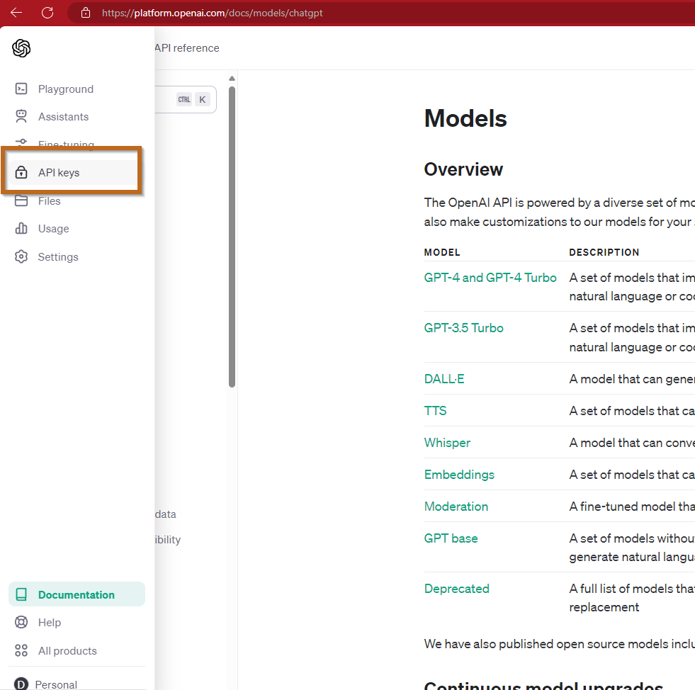
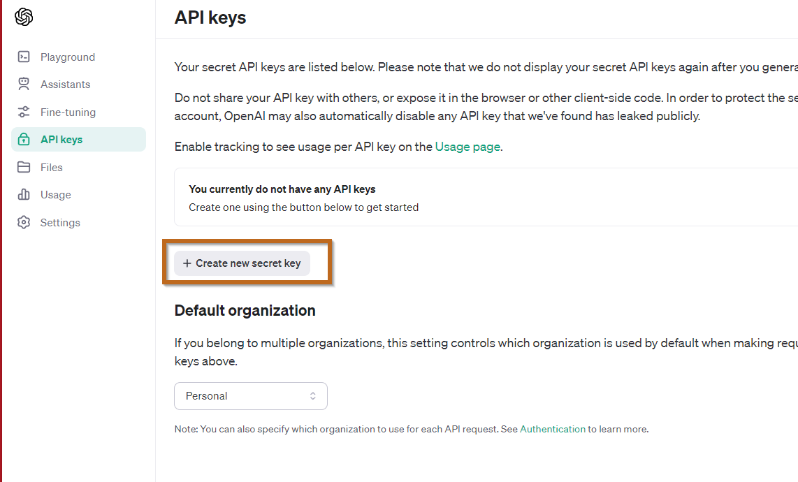
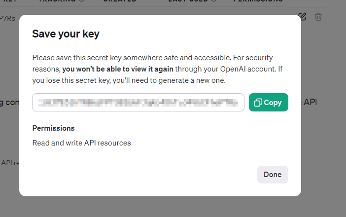

# Exercise: Obtaining Your ChatGPT API Keys

This exercise will guide you through the process of obtaining your ChatGPT API keys. API keys are essential for accessing and interacting with ChatGPT programmatically. Follow these steps to get started:

## Step 1: Sign Up or Log In to OpenAI

- If you don't already have an account, visit [OpenAI's website](https://openai.com/) and sign up.
- If you have an account, log in to proceed.

## Step 2: Access the API Dashboard

- Navigate to the API section by clicking on "API" in the top menu.
- Here, you'll find information about API usage and keys.

## Step 3: Create a New API Key

- In the API dashboard, look for a button or link labeled "Create new API key" or "Generate API key".
- Click this to create a new key.

## Step 4: Copy Your API Key

- Once your API key is generated, make sure to copy it and store it securely.
- Note: Keep your API key private and do not share it publicly.

## Step 5: Understand Your Key's Capabilities

- Familiarise yourself with the permissions and limitations associated with your API key.
- This information is crucial for managing your usage and costs effectively.

## Exercise Completion

Congratulations! You've successfully obtained your ChatGPT API keys. With these keys, you're now ready to explore and utilise the capabilities of ChatGPT in your projects. Remember to review the documentation provided by OpenAI to understand the best practices for using your API keys.
